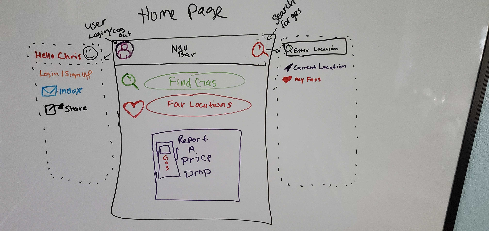
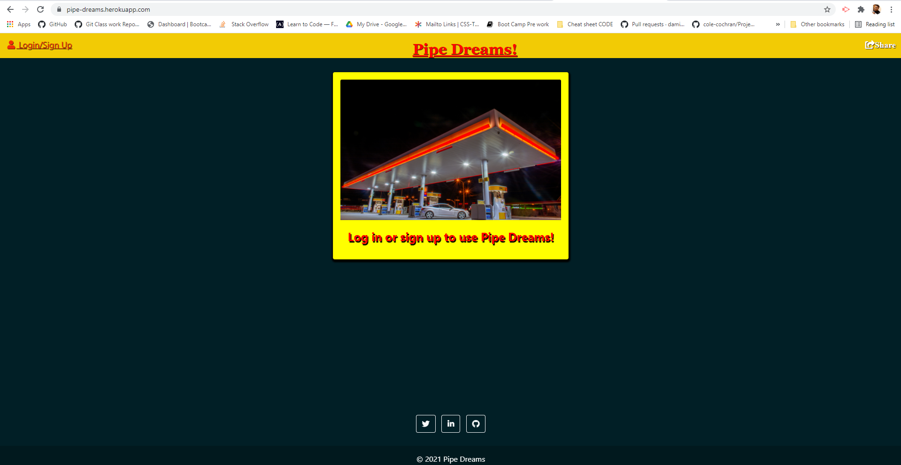
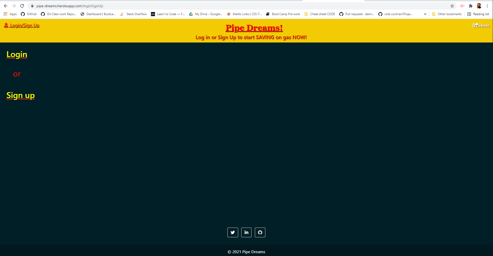
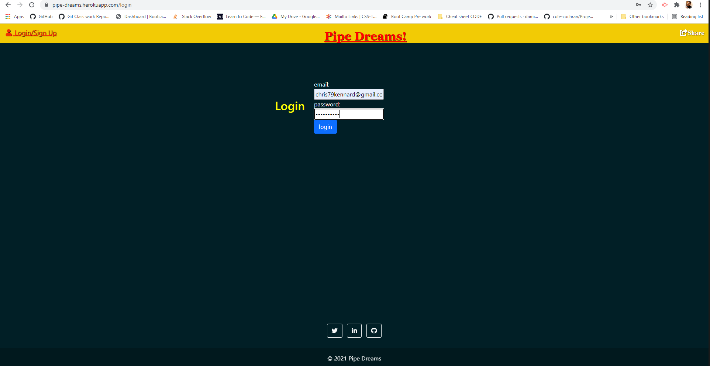
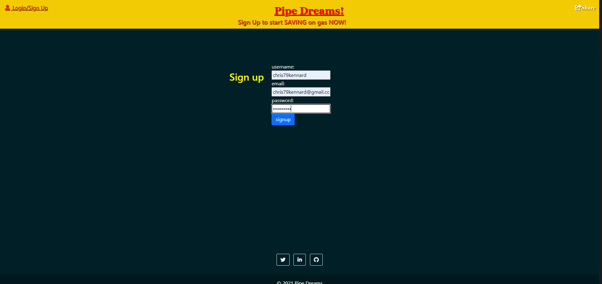
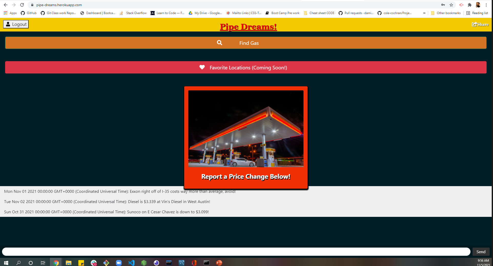
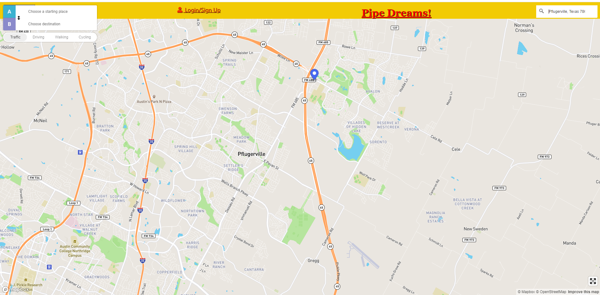

# Pipe Dreams!
```
Are gas prices getting to high for you? Yeah us too! 
Ever gone out of town and had the inconvenience of not being sure where to find the closest
gas station for a fill up in a pinch? Pipe Dreams has the solutions! Not only will you be
able to locate the closest gas station to you but you will also be able to see and compare
prices to know your getting the best bang for your buck! What are you waiting for!?
keep reading below to find how you can start saving money and time now! 
```
## Purpose
Pipe Dreams is an application that helps you find the lowest priced gas near you. Wether if your at home or in another city your not familiar with rest assured you will know where the best deal is on gas with in your proximity. Via the application the user is able to type in any location, address or zip code and are met with a map detailing the most near by locations and prices for gas all around you.
## Getting Started
To use the Application just go to the Deployed link below. 

[Access The Deployed Project Here!](https://pipe-dreams.herokuapp.com/)
#### Deployed Date: 11/5/2021 
#### Contributors: Christopher Kennard, Mat Lundin, Cole Cochran and William Renfroe

## ScreenShots


---
#### Desktop layout


---

---

---

---

---

---
* See How-To documentation for Instructions
---
## Future Features
+ Saving favorite locations
+ Display user name on messages
+ Saving  users prior searches
---
## Frameworks Used
### 1. <b>Code Editor</b>
+ Visual Studio Code
### 2. <b>Version Control</b>
+ Heroku
+ Github
### 3. <b>CSS Component Library</b>
+ Bootstrap
### 4. <b>Tools</b>
+ Font awesome icons

### 5. <b>API</b>
+ Here 
+ mapbox-gl
+ mapbox-gl-controls
+ axios
+ bcrypt
+ connect-sessions-sequelize
+ dotenv
+ express
+ express-handlebars
+ express-session
+ mysql2
+ nodemon
+ sequelize
+ socket.io

## Special Thanks
+ Christain (TA)
+ Megan (TA)
+ Leah (Instructor)
---
## References
+ [MDN WebDocs](https://developer.mozilla.org/en-US/)
+ [W3 Schools](https://www.w3schools.com/)
+ [CSS Tricks](https://css-tricks.com/)
---
## License
[MIT](https://choosealicense.com/licenses/mit/)

